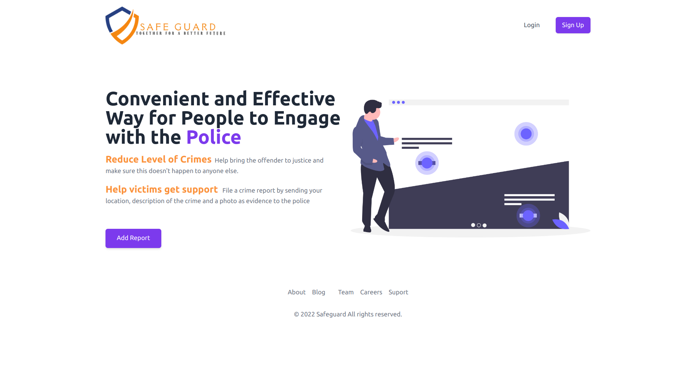
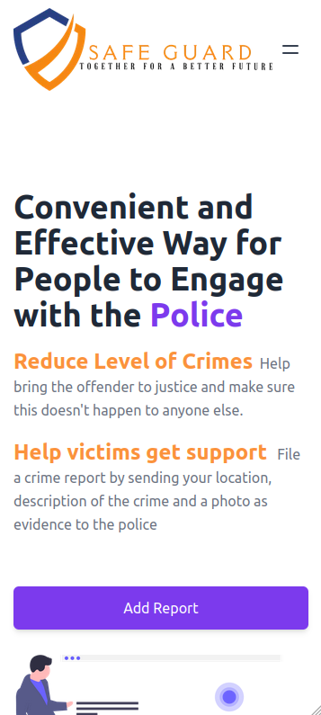
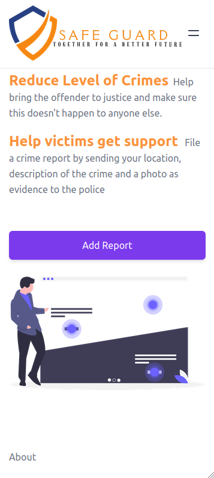

# Google-Africa-Developer-Open-Team-9 Community Project

## Project Name: Safeguard

<table>
 <tr>
 <td>
     
    </td>
    <td> 
    
    </td>
    
   </tr> 
   
</table>

## Project Description
Safegurd is a security monitoring app that will help users to report crimes happening in their neighbourd as soon as the crime happens.

It helps the users to report any incidents such as theft, mob justice, rape, murder, bullying or any other crimes and the admins ( in this case the police) to have visibility of what crimes are happening in their localities.

## Key Stakeholders
- Police {Admins)
- Civilians (Normal Users)

## Functionality
1. Normal Users
----------------------------------
- The User can register for an account using their email/phone number
- They can log into the system 
- Users can report a crime by feeling in a form.
- Users can see the frequency of crimes and nature of crimes happening within their vicinity
- User can see the status of the reported crimes

2. Admins (The police)
-------------------------------
- They can see a report of reported crimes.
- They can respond to a crime and update its status.
- The can see a dashboard with statistics of the number of crimes happening within the community.

## Team Members
- Herman Ceaser 
- Robert Ngabomugisha
- Mempho Esther 
- Omar Farouk

 
